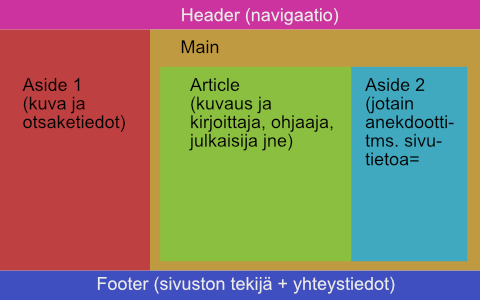
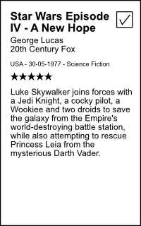
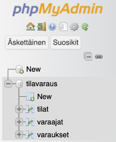
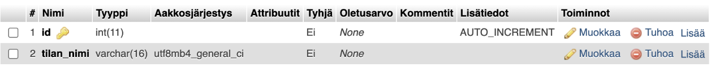
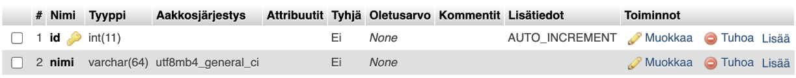
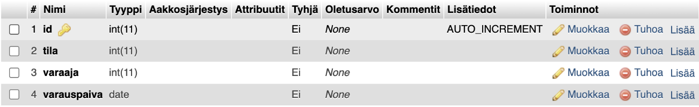
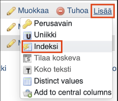
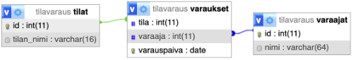

# Viikko 44
## Maanantai 
Kyselyn perusteella kurssilaisilla on perus-web-teknologiat aika hyvin hallussa, mutta aloitetaan kuitenkin perusteista, ja tehdään vähän sormiharjoituksia, niin saadaan verryteltyä koodauslihaksia.

Aloitetaan asentamalla työkalut ellei ne jo löydy työkoneista: 
- VSCode: https://code.visualstudio.com/  
- Python: https://www.python.org/  
- Chrome ja Firefox (projektia on hyvä testata parilla eri selaimella ihan varmuuden vuoksi): https://www.google.com/chrome/ ja https://www.mozilla.org/fi/firefox/new/  
- Onhan kaikilla GitHub-tili: https://github.com/  

### Tehtävä 1: staattiset perus-HTML-sivut 

Toteuta HTML:llä itsellesi CV-sivu, jossa kerrot itsestäsi, osaamisestasi ja historiastasi. 

Muistellaan HTML-dokumentin perusrakennetta, ja mitä metadataa head-tagiin voidaan sisällyttää. Muistutetaan mieliin perus-tagit `h1-h6`, `p`, `div`, `a`, `img`, numeroidut ja numeroimattomat listat, listaelementit ja taulut. 

Muotoilu tai ulkoasu ei ole tässä tehtävässä olennaista, mutta pyri siihen, että käytät eri tageja asianmukaisesti, esimerkiksi voit tehdä osaamisestasi taulukon ja työhistoriastasi listan. 

### Tehtävä 2: useammasta HTML-sivusta koostuva sivusto 

Toteuta sivusto, jossa listaat esimerkiksi 5 – 10 lempielokuvaasi, -kirjaasi tai -peliäsi, kukin omalla sivullaan. Toteuta sivusto niin, että siinä on etusivu ja alasivut, joiden välillä pystyy navigoimaan linkkien avulla. Kullakin sivulla tulisi olla ainakin yksi kuva, otsikko ja kuvaus aiheesta, perustietoja kuten julkaisuvuosi, julkaisumaa, kirjoittaja tai ohjaaja jne, ja esim. jotain anekdoottitietoa. Voit kopioida sisällön esim. imdb:stä, Wikipediasta tai muusta lähteestä, ei tarvitse kirjoittaa kaikkea itse. 

Mieti sivuston rakennetta ja sisältöä ja käytä asianmukaisia semanttisia tageja kuten `nav`, `article`, `section`, `figure`, `figcaption` jne. Muistutetaan mieleen, miten CSS tuodaan dokumenttiin, ja miten CSS-valitsimet, luokat ja id:t toimivat. Perehdytään miten spesifisyys ja perintä vaikuttavat siihen, mitkä päällekkäiset CSS-säännöt ovat milloinkin voimassa. 

#### Resursseja
- https://www.w3schools.com/html/default.asp 
- https://developer.mozilla.org/en-US/docs/Web/HTML
- https://developer.mozilla.org/en-US/docs/Glossary/Semantics

Semanttinen HTML: 
- https://www.youtube.com/watch?v=ZThq93Yuwd0  

CSS lyhyesti:
- https://www.youtube.com/watch?v=OEV8gMkCHXQ  
- https://www.youtube.com/watch?v=1PnVor36_40  

## Tiistai 

Jatketaan web-teknologioiden kertauksella. Otetaan mukaan muotoilu ja interaktiivisuus. 

HTML:ssä eri elementeillä on omat sisäänrakennetut perusmuotoilut, jotka ovat jotakuinkin standardoituja, mutta voivat hieman vaihdella eri selainten ja käyttöjärjestelmien mukaan. Jos halutaan (ja yleensähän halutaan) muotoilla web-sisältöä tarkemmin, siihen käytetään CSS:ää.  

Web-palvelun muotoilun toteuttaminen pelkästään raa'alla CSS:llä on nykyisin harvinaista, sillä useimmissa projekteissa käytetään valmiita UI-kirjastoja. Nämä kirjastot kuitenkin käyttävät CSS:ää pellin alla, ja niiden debuggaaminen tai ulkoasun hienosäätäminen vaatii, että CSS on jotakuinkin hallussa. Lisäksi vaikka kirjastojen tarjoamat valmiit yksittäiset komponentit olisivat miten siistejä tahansa, sivun taitto eli asettelu jää yleensä toteuttajan harteille. 

Web-palveluiden käyttöliittymän interaktiivisuuden toteuttamiseen käytetään JavaScriptiä, mutta ei pidä unohtaa, että HTML:stä löytyy nykyisin paljon valmiita sisäänrakennettuja elementtejä monenlaiseen käyttöön. Aina ei tarvitse rakentaa pyörää uudestaan, tai edes etsiä jonkun muun rakentamaa pyöräkomponenttia, jos selaimessa jo oleva pyörä täyttää tarpeet. Tiesitkö esimerkiksi, että HTML:ssä on nykyisin sisäänrakennettu [dialogikomponentti](https://developer.mozilla.org/en-US/docs/Web/HTML/Element/dialog) ja [kalenterikenttä](https://developer.mozilla.org/en-US/docs/Web/HTML/Element/input/date)? 

### Tehtävä 1: Flex-asettelu 

Otetaan käyttöön HTML:n rakenteelliset tagit kuten header, footer, main ja aside. Pohjana on aiemmin toteutettu leffa/kirja/peli-sivusto, ja toteutetaan tässä tehtävässä asettelu **flexboxilla**, ks. viivakuva 


Tässä siis Main-osiossa ei ole omaa tekstisisältöä ollenkaan, vaan se on pelkästään Article- ja Aside 2-osioiden wrapperi. Yritä toteuttaa asettelu niin, että Header, Footer ja Aside 1 pysyvät aina paikallaan, mutta Main-alue rullaa silloin, kun sen sisältö ei mahdu siihen.

### Tehtävä 2: Grid-asettelu 

Tehdään sivustosta uusi versio, jossa asettelu on samanlainen kuin edellisessä tehtävässä, mutta toteutettu **CSS-gridillä**. 

### Tehtävä 3: HTML-lomake 

Lisätään olemassaolevaan sivustoon uusi sivu, jolla on lomake, johon voidaan syöttää uuden elokuvan (kirjan, pelin tms) nimi, ohjaaja, julkaisija, julkaisupäivä, julkaisumaa, genre, synopsis, arvostelu (tähtien määrä 1 –5) ja tieto, onko elokuva jo katsottu.

Julkaisumaa on pudotusvalikko, genre radiopainikkeita, synopsis textarea, arvostelu numerokenttä, julkaisupäivä päivämääräkenttä ja katsottu-tieto valintaruutu (checkbox). Muut kentät ovat tekstikenttiä.

Kun käyttäjä lomakkeen OK-painiketta, sivulla oleva JS poimii arvot lomakkeen kentistä, ja luo niiden pohjalta elokuvasta infokortin, joka näyttää suunnilleen tällaiselta:



Tietoja ei tarvitse tallettaa minnekään pysyvästi, tässä vain harjoitellaan HTML:n ja JS:n yhteispeliä.

#### Resursseja
https://css-tricks.com/snippets/css/a-guide-to-flexbox/
https://css-tricks.com/snippets/css/complete-guide-grid/

Flexbox: 
- https://www.youtube.com/watch?v=K74l26pE4YA 
- https://www.youtube.com/watch?v=GteJWhCikCk  

CSS Grid: 
- https://www.youtube.com/watch?v=uuOXPWCh-6o  
- https://www.youtube.com/watch?v=EiNiSFIPIQE  

Uusia HTML-toiminnallisuuksia: 
- https://www.youtube.com/watch?v=LNmS6Mwwbf4 


## Keskiviikko 

Siirrytään tietokantojen perusteisiin. Asennetaan koneelle [XAMPP](https://www.apachefriends.org/  ), joka on ohjelmistopaketti, joka sisältää Apache-verkkopalvelimen, MySQL (tai MariaDB)-tietokannan ja PHP-tulkin.  

Asentamisen jälkeen avaa XAMPP Control Panel, ja käynnistä sieltä **Apache** ja **MySQL**-palvelut. Etsi XAMPP-asennuskansiosta kansio nimeltä `htdocs`. Tämä on web-serverin kotikansio: jos sijoitat tähän kansioon HTML- tai PHP-tiedostoja, Apache tarjoilee ne osoitteessa http://localhost. Sijoitamme tehtävän 2 PHP-koodit tänne. 

Lisäksi XAMPP tarjoaa web-käyttöliittymän MySQL-tietokantaan osoitteessa http://localhost/phpmyadmin. Oletuksena root-käyttäjällä ei ole salasanaa. 


### Tehtävä 1: luodaan taulut yksinkertaista tilavarausjärjestelmää varten 

- Avaa [PHPMyAdmin](http://localhost/phpmyadmin) 
- Luo uusi tietokanta nimeltä **tilavaraus**
- Luo tähän kantaan taulut nimeltä **tilat**, **varaajat** ja **varaukset**.


- Tee tilat-tauluun sarakkeet **id** (INT, AUTO_INCREMENT) ja **tilan_nimi** (VARCHAR) 


- Varaajat-tauluun **id** (INT, AUTO_INCREMENT) ja **varaajan_nimi** (VARCHAR) 


- Varaukset-tauluun **id** (INT, AUTO_INCREMENT), **varaaja** (INT), **tila** (INT) ja **varauspaiva** (DATE) 


- Luo indeksit varaukset-taulun varaaja- ja tila-kentille


- Yhdistä varaajat- ja tilat-taulujen id-kentät varaukset-taulun varaaja- ja tila-kenttiin suunnittelija-näkymässä ([designer](http://localhost/phpmyadmin/index.php?route=/database/designer&db=tilavaraus)) 


- Lisää lopuksi kaikkiin tauluihin muutama rivi tietoa: ensin varaaja- ja tila-tauluihin ja sitten varaustauluun. 
 
### Tehtävä 2: luodaan tauluihin web-käyttöliittymä 

Luodaan htdocs-kansioon PHP-pohjainen sivusto, jossa tietokannan tauluja voi tarkastella, ja lisätä ja poistaa niihin rivejä. 

PHP-tiedostot toimivat niin, että niissä voi olla normaalia HTML-koodia, mutta sen joukkoon voi sijoittaa PHP-skriptiä kirjoittamalla sen php-tagin sisään: <?php …php-koodia... ?>. Kun selain pyytää PHP-tiedostoa, serveri evaluoi PHP-koodit, ja palauttaa selaimelle HTML:n, jossa on evaluoinnin tulokset. 

Esimerkiksi voimme luoda ruokalistan iteroimalla $menu –muuttujaa, jossa ruoat ovat listamuodossa: 

```php
<ul> 
    <?php 
        foreach($menu as $ruoka) { 
            echo "<li>" . $ruoka . "</li>"; 
        } 
    ?> 
</ul> 
```
Evaluoinnin jälkeen serveri palauttaa esim. jotain tämän näköistä: 
```html
<ul> 
    <li>Hampurilainen</li> 
    <li>Pizza</li> 
    <li>Nuudeli</li> 
    <li>Kaurapuuro</li> 
</ul> 
```
Tietokantaan otetaan yhteys ja sieltä kysellään tietoa esim. näin: 
```php
<?php 
    $host= "localhost"; 
    $username = "dbuser"; 
    $database = "somedb"; 
    $password = "password"; 
    try { 
        $yhteys = new PDO("mysql:host=$host;dbname=$database", $username, $password); 
        $yhteys->setAttribute(PDO::ATTR_ERRMODE, PDO::ERRMODE_EXCEPTION); 
    } 
    catch(PDOException $e){ echo "<p>".$e->getMessage()."<p>"; } 
    $sql_lause =  "SELECT * FROM table"; 
    try { 
        $query= $yhteys->prepare($sql_lause); 
        $query->execute(); 
    }  
    catch (PDOException $e) { die("VIRHE: " . $e->getMessage()); } 
    $result= $query->fetchAll(); 
?> 
```
#### Resurssit: 

- https://www.apachefriends.org/  
- https://www.tutorialspoint.com/phpmyadmin/phpmyadmin_databases.htm 
- https://www.w3schools.com/php/default.asp 
- https://www.w3schools.com/php/php_mysql_intro.asp 
- https://www.w3schools.com/php/php_forms.asp  

## Torstai 

Harjoitellaan Pythonin virtuaaliympäristön pystyttämistä, kirjaston asentamista ja tietokantojen kanssa työskentelyä. 

Varsinaisessa projektissa tullaan käyttämään [Django-frameworkkia](https://www.djangoproject.com/), jossa on omat luokat tietokantojen käsittelyyn ja näkymien rakentamiseen, mutta käytetään tässä verryttelyharjoituksessa kevyempiä työkaluja. 

### Tehtävä: SQLite-kannan käsittely ja cli-käyttöliittymä 

Navigoidaan terminaalilla kansioon, johon projekti halutaan tehdä, ja annetaan komento `python –m venv venv`. Tämä luo suljetun virtuaaliympäristön, johon voidaan asentaa kirjastoja paikallisesti niin, että eri projektien riippuvuudet eivät sotke toisiaan. Virtuaaliympäristö käynnistetään Windowsissa komennolla `venv\Scripts\activate`, minkä jälkeen ympäristöön voi asentaa kirjastoja `pip`-komennolla. 

**SQLite3**-kirjasto tulee Pythonin mukana, mutta asennetaan taulujen esittämistä helpottamaan **Tabulate**-kirjasto komennolla `pip install tabulate`. 

Tehtävänä on toteuttaa Pythonilla ja SQLitellä sama rakenne kuin edellisessä XAMPP-tehtävässä, eli tilanvaraustietokanta. Lisäksi toteutetaan tekstipohjainen käyttöliittymä, jolla käyttäjä voi tarkastella ja muokata taulujen sisältöä. 

Pythonin SQLitellä käytetään tietokantaa tiedostosta `database.db` seuraavasti: 
```python
import sqlite3 
from tabulate import tabulate 

conn = sqlite3.connect('database.db') 
cursor = conn.cursor() 

cursor.execute('''SELECT * FROM table;''') 
rows = cursor.fetchall() 
if rows: 
    print(tabulate(rows, headers=["ID", "Value"], tablefmt="grid")) 
else: 
    print("No rows in table.") 
```

Komento `sqlite3.connect('database.db')` tarkistaa, onko tuon nimistä tiedostoa jo olemassa, ja ellei ole, se luo sen.

#### Resursseja: 
- https://www.sqlite.org/
- https://www.geeksforgeeks.org/python-sqlite/  
- https://www.tutorialspoint.com/sqlite/sqlite_python.htm 
- https://pypi.org/project/tabulate/ 

## Perjantai 

Jatketaan Pythonin parissa: tällä kertaa otetaan haltuun sen HTTP-kirjasto, ja perehdytään, miten MySQL-kantojen kanssa toimitaan. 

### Tehtävä: HTTP-backend MySQL-tietokannalle 

Tehdään XAMPP-tehtävän MySQL-kantaa käyttävä web-käyttöliittymä, joka pyörii Pythonilla toteutetun web-serverin päällä. Käytämme HTTP-palvelimen luomiseen Pythonin standardikirjastoon kuuluvaa HTTP-kirjastoa. MySQL:ää varten täytyy asentaa ajuri: `pip install mysql-connector-python`. 

Luo ensin näkymät taulujen sisällön tarkastelua varten. Jos ehdit, toteuta myös rivien lisääminen ja poistaminen. Voit rakentaa HTML-näkymät käsin, tai halutessasi voit käyttää jotain template-kirjastoa kuten [Jinja](https://jinja.palletsprojects.com/en/stable/). 

Resurssit: 
- https://www.w3schools.com/python/python_mysql_getstarted.asp 
- https://anshu-dev.medium.com/creating-a-python-web-server-from-basic-to-advanced-449fcb38e93b 
- https://jinja.palletsprojects.com/en/stable/ 